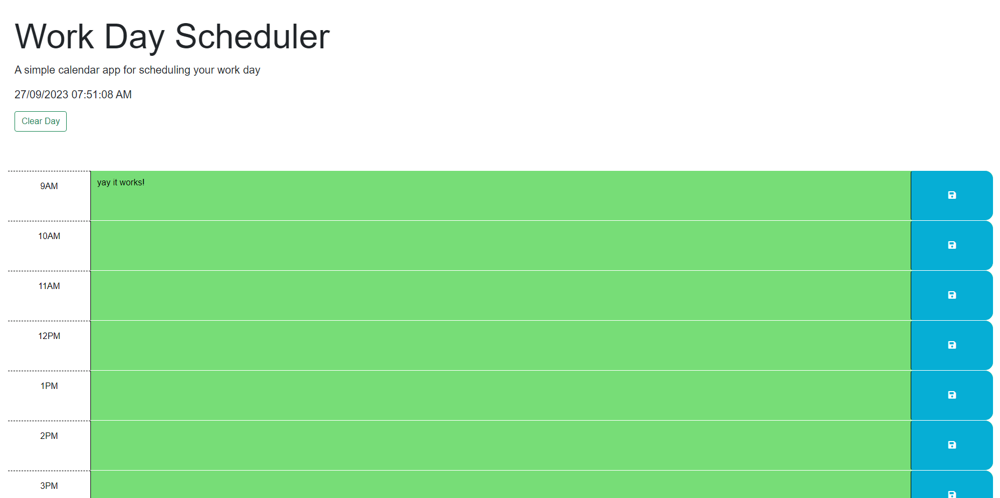

# Work Day Scheduler Starter Code

## Screenshot

## Usage
This workday scheduler is meant to store data for a certain time block into local storage for events. Each time block is color coded to indicate if it is in the past, present, or future. Try typing in text into a box and hit the save button so it saves even if you refresh the page.

## Link
https://brandong21.github.io/WorkDayScheduler/

## Refrences 
Recieved help from fellow students and tutors for help on the javascript code.